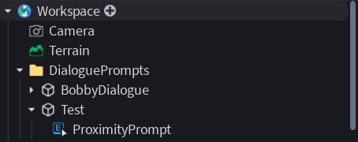

# Insop Dialogue Kit

A Roblox dialogue system inspired by Disco Elysium, supporting branching conversations and scalable dialogue trees.

## Features
- **Branching dialogue** with multiple choices and conditional paths
- **Callback system** — replies can execute arbitrary functions
- **Rich text formatting** - supports (bold, color, etc.)
- **Auto-scrolling dialogue history** - follows dialogues
- **Customizable Icons** for dialogues 

## Installation
1. Download `InsopDialogueKit.rbxm`
2. In Roblox Studio: right-click in Explorer → Insert from File → select the .rbxm
3. Place **DialoguePrompts** in Workspace
4. Place **InsopDialogueGui** into StarterGui
5. In **DialoguePrompts**, add your object of choice with a ProximityPrompt

